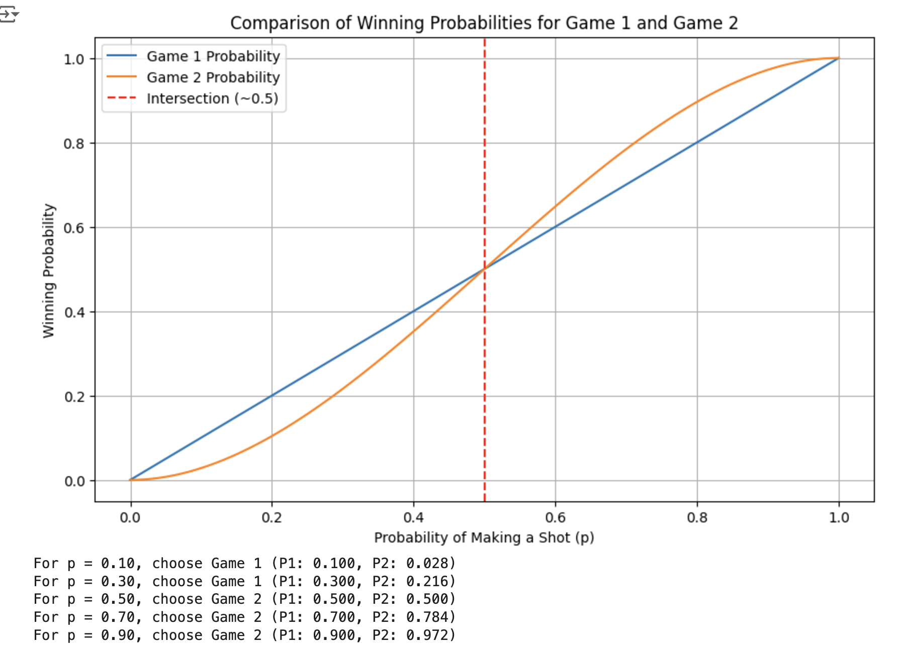

# Basketball

- You have a basketball hoop and someone says that you can play one of two games.
    
    - Game 1: You get one shot to make the hoop.
    - Game 2: You get three shots and you have to make two of three shots.

    If p is the probability of making a particular shot, for which values of p should you pick one game
    or the other?

### Approach

- Calculate probability with the probability mass function of a binomial distribution 

    $$
    P(X = k) = \binom{n}{k} p^k (1-p)^{n-k}
    $$

    - P(X = k) = (n choose k) * p^k * (1-p)^(n-k)

- Game1 : P(game1) = p

- Game 2 : P(X = 2) + P(X = 3)

### Prerequisite

- Probability

### Python

```python
import numpy as np
import matplotlib.pyplot as plt

def game1_probability(p):
    return p

def game2_probability(p):
    return 3 * p**2 * (1 - p) + p**3

p_values = np.linspace(0, 1, 1000)
game1_probs = game1_probability(p_values)
game2_probs = game2_probability(p_values)

# plot
plt.figure(figsize=(10, 6))
plt.plot(p_values, game1_probs, label="Game 1 Probability")
plt.plot(p_values, game2_probs, label="Game 2 Probability")
plt.axvline(x=0.5, color='red', linestyle='--', label="Intersection (~0.5)")
plt.xlabel("Probability of Making a Shot (p)")
plt.ylabel("Winning Probability")
plt.title("Comparison of Winning Probabilities for Game 1 and Game 2")
plt.legend()
plt.grid()
plt.show()

# Determine for which values of p to choose each game
for p in [0.1, 0.3, 0.5, 0.7, 0.9]:
    g1 = game1_probability(p)
    g2 = game2_probability(p)
    if g1 > g2:
        print(f"For p = {p:.2f}, choose Game 1 (P1: {g1:.3f}, P2: {g2:.3f})")
    else:
        print(f"For p = {p:.2f}, choose Game 2 (P1: {g1:.3f}, P2: {g2:.3f})")
```

- Result Graph

    

# Dominos

- There is an 8x8 chessboard in which two diagonally opposite corners have been cut off. You are given 31 dominos, and a single domino can cover exactly two squares. Can you use the 31 dominos to cover the entire board? Prove your answer (by providing an example or showing why `it's impossible`)

### Approach

- Domino covers exactly 2 squares that are adjacent to each other. And chessboard squares are different colors (Black and White)

- So, when Domino cover exactly two squares, It will always cover one black and one while

- Therefore, the number of black squares and white squares must be equal

- However, Every chessboard always the same color in the diagonally opposite corners

- Thus, It is impossible

### Python

```python
def can_cover_with_dominos():
    board = [[(i + j) % 2 for j in range(8)] for i in range(8)]
    # Delete two diagonally opposite corners
    board[0][0] = -1
    board[7][7] = -1
    
    black_count = sum(cell == 1 for row in board for cell in row)
    white_count = sum(cell == 0 for row in board for cell in row)
    
    print("Black squares:", black_count)
    print("White squares:", white_count)
    
    if black_count != white_count:
        return "Impossible to cover the board with 31 dominos."
    else:
        return "Possible to cover the board with 31 dominos."

print(can_cover_with_dominos())
```

- Proof: The opposite corners of an N * N chessboard have the same color

    - Example
   
        If (i + j) is even == white
        
        If (i + j) is odd == black
        
        And (0, 0) is even == white
    
    - So, The bottom-right corner is

        (N - 1) + (N - 1) = 2N - 2 == Always `even`

# 100 Lockers

- There are 100 closed lockers in a hallway. A man begins by opening all 100 lockers. Next, he closes every second locker. 

    Then, on his third pass, he toggles every third locker (closes it if it is open or opens it if it is closed). 
    
    This process continues for 100 passes, such that on each pass i, the man toggles every ith locker. After his 100th pass in the hallway, in which he toggles only locker #100, how many lockers are open?

### Approach

- For example, scenario with 6 lockers (not a 100)

    ```text
    O : open , C : close

    1 2 3 4 5 6
    O O O O O O
      C   C   C
        C     O
          O
            C
              C
    ```

    Only 1, 4 locker is opened

- Odd number of divisors (1, 4, 9, ...) == Locker is always closed

    2 of divisor : 1, 2 (even) == Locker is closed

    6 of divisor : 1, 2, 3, 6 (even) == Locker is closed

- Thus, only lockers numbered as perfect squares will remain open

### Python

```python
def countOpenLockers(n):
    return int(n**0.5)

# Ask the number of lockers
try:
    n = int(input("Number of lockers : "))
    if n <= 0:
        print("Only positive integer")
    else:
        result = countOpenLockers(n)
        print(f"Number of openv lockers for {n} lockers : {result}")
except ValueError:
    print("Invalid Input")
```

# Posion

- You have 1000 bottles of soda, and exactly one is poisoned. You have 10 test strips which
can be used to detect poison. A single drop of poison will turn the test strip positive permanently.

    You can put any number of drops on a test strip at once and you can reuse a test strip as many time as you'd like (as long as the results are negative). 

    However, you can only run tests once per day and it takes seven days to return a result. How would you figure out the poisoned bottle in as few days as possible?

### Approach

- Since binary is `0, 1`, it can also be interpreted as `True, False`. Therefore, converting numbers (0 ~ 1000) into binary.

- A 10-bit binary number can represent up to 1024, so the range is sufficient. Now, think of each binary digit as a test strip

    bit == The place where I can use test strip

- If the digit is 1, using the test strip. Even if non-poison drinks continuously tested, the result will remain negative

    However, `negative test strip` encounters a poison soda, the result will react positively

- Test all 1000 drinks with the test strips in `one day` and wait 7 days after the result

    If the result is negative -> converting 0
    
    Result is positive -> 1

- Convert this binary -> Convert 10-base again -> This bottle is poison

### Python

```python
import random

def findPoisonBottle(numBottles=1000, numStrips=10):
    poisonedBottle = random.randint(1, numBottles)
    bottles = list(range(1, numBottles + 1))
    binaryList = [format(bottle, f'0{numStrips}b') for bottle in bottles]
    results = [0] * numStrips

    for i in range(numStrips):
        if format(poisonedBottle, f'0{numStrips}b')[i] == '1':
            results[i] = 1

    print(f"Simulated test strip results: {results}")
    detectedBinary = ''.join(map(str, results))
    detectedPoisonedBottle = int(detectedBinary, 2)
    
    if detectedPoisonedBottle == poisonedBottle:
        return detectedPoisonedBottle
    else:
        return f"Error: Detected bottle ({detectedPoisonedBottle}) does not match the actual poisoned bottle ({poisonedBottle})."

detectedBottle = findPoisonBottle()
print(f"The poisoned bottle detected by the algorithm is: {detectedBottle}")
```
- Result

```text
Simulated test strip results: [1, 1, 1, 0, 0, 0, 1, 0, 0, 1]
The poisoned bottle detected by the algorithm is: 905
```

- `format(bottle, f'010b')` : Convert a `decimal number (bottle)` into a binary

    ```text
    binaryList = [format(bottle, f'0{numStrips}b') for bottle in bottles]
                                   0 : padding with zeros
                                     numStrips (10) : 10 characters
                                               b : binary
    ```

    ```python
    print(format(5, '8b'))    # 8 characters, padded with spaces: "     101"
    print(format(5, '08b'))   # 8 characters, padded with zeros: "00000101"
    ``` 

- List Comprehension 

    ```python 
    binaryList = [format(bottle, f'0{numStrips}b') for bottle in bottles]
    ```

    More intuitive and easier

- Using `lambda` with `map()`

    ```python
    binaryList = list(map(lambda bottle : format(bottle, f'0{numStrips}b', bottles)))
    ```

    Simple, But it is hard to notice what it is
    
    So, `lambda` is called : anonymous function

### Java

```java
import java.util.Random;

public class PoisonBottle {
    public static void main(String[] args) {
        int numBottles = 1000;
        int numStrips = 10;

        int poisonedBottle = new Random().nextInt(numBottles) + 1;
        String[] binaryList = new String[numBottles];
        int[] results = new int[numStrips];

        for (int i = 0; i < numBottles; i++) {
            binaryList[i] = String.format("%" + numStrips + "s", Integer.toBinaryString(i + 1)).replace(' ', '0');
        }

        String poisonedBinary = String.format("%" + numStrips + "s", Integer.toBinaryString(poisonedBottle)).replace(' ', '0');
        for (int i = 0; i < numStrips; i++) {
            if (poisonedBinary.charAt(i) == '1') {
                results[i] = 1;
            }
        }

        System.out.println("Simulated test strip results:");
        for (int result : results) {
            System.out.print(result);
        }
        System.out.println();

        StringBuilder detectedBinary = new StringBuilder();
        for (int result : results) {
            detectedBinary.append(result);
        }
        int detectedPoisonedBottle = Integer.parseInt(detectedBinary.toString(), 2);

        if (detectedPoisonedBottle == poisonedBottle) {
            System.out.println("The poisoned bottle detected by the algorithm is: " + detectedPoisonedBottle);
        } else {
            System.out.println("Error: Detected bottle (" + detectedPoisonedBottle + ") does not match the actual poisoned bottle (" + poisonedBottle + ").");
        }
    }
}
```

- `int poisonedBottle = new Random().nextInt(numBottles) + 1;`

    Since the object is not stored in a variable, this Random object cannot be reused after the method call

    Therefore, the Random object is temporarily created in memory, and once its use is complete, it is cleaned up by the `Garbage Collector (GC)`

- Java : `binaryList[i] = String.format("%" + numStrips + "s", Integer.toBinaryString(i + 1)).replace(' ', '0');`

    == Python : `binaryList = [format(bottle, f'0{numStrips}b') for bottle in bottles]`

    - `"%" + numStrips + "s"` : the fixed width of numStrips(10)

- `StringBuilder detectedBinary = new StringBuilder();` 

    Unlike `String` class, `StringBuilder` is mutable, meaing it allows modifications to string

### C++

```c++
#include <iostream>
#include <bitset>
#include <cstdlib>
#include <ctime>
#include <string>

int main() {
    const int numBottles = 1000;
    const int numStrips = 10;

    srand(time(0));
    int poisonedBottle = rand() % numBottles + 1;
    int results[numStrips] = {0};

    std::string poisonedBinary = std::bitset<10>(poisonedBottle).to_string();
    for (int i = 0; i < numStrips; i++) {
        if (poisonedBinary[i] == '1') {
            results[i] = 1;
        }
    }

    std::cout << "Simulated test strip results: ";
    for (int i = 0; i < numStrips; i++) {
        std::cout << results[i];
    }
    std::cout << std::endl;

    std::string detectedBinary = "";
    for (int i = 0; i < numStrips; i++) {
        detectedBinary += std::to_string(results[i]);
    }
    int detectedPoisonedBottle = std::stoi(detectedBinary, nullptr, 2);

    if (detectedPoisonedBottle == poisonedBottle) {
        std::cout << "The poisoned bottle detected by the algorithm is: " << detectedPoisonedBottle << std::endl;
    } else {
        std::cout << "Error: Detected bottle (" << detectedPoisonedBottle << ") does not match the actual poisoned bottle (" << poisonedBottle << ")." << std::endl;
    }

    return 0;
}
```

- `srand(time(0))`

    time(0) : Return the current time in seconds

    So, the random numbers is generated every time the program is executed because time is always change

### Go

```go
package main

import (
	"fmt"
	"math/rand"
	"strconv"
	"time"
)

func main() {
	rand.Seed(time.Now().UnixNano())
	numBottles := 1000
	numStrips := 10

	poisonedBottle := rand.Intn(numBottles) + 1
	results := make([]int, numStrips)

	poisonedBinary := fmt.Sprintf("%0*b", numStrips, poisonedBottle)
	for i := 0; i < numStrips; i++ {
		if poisonedBinary[i] == '1' {
			results[i] = 1
		}
	}
	fmt.Printf("Simulated test strip results: %v\n", results)

	detectedBinary := ""
	for _, result := range results {
		detectedBinary += strconv.Itoa(result)
	}
	detectedPoisonedBottle, _ := strconv.ParseInt(detectedBinary, 2, 64)

	if int(detectedPoisonedBottle) == poisonedBottle {
		fmt.Printf("The poisoned bottle detected by the algorithm is: %d\n", detectedPoisonedBottle)
	} else {
		fmt.Printf("Error: Detected bottle (%d) does not match the actual poisoned bottle (%d).\n", detectedPoisonedBottle, poisonedBottle)
	}
}
```

- `rand.Seed(time.Now().UnixNano())`

    `rand` generates pseudo-random numbers, and return the current time as a nanosecond timestamp

- C++ : `int results[numStrips] = {0};` == Go : `results := make([]int, numStrips)`

    make : create a slice of int with length of numStrips
    
    All elements initialized to default value `0`

-  `%0*b` format specifier : padding with `0` 

    == C++ : `std::string poisonedBinary = std::bitset<10>(poisonedBottle).to_string();`

    == Java : `String poisonedBinary = String.format("%" + numStrips + "s", Integer.toBinaryString(poisonedBottle)).replace(' ', '0');`
