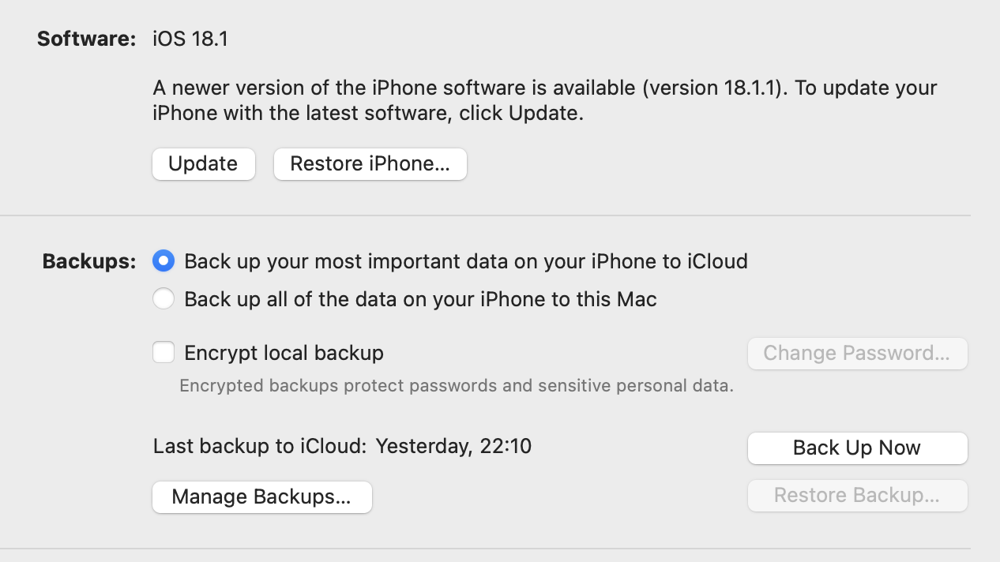
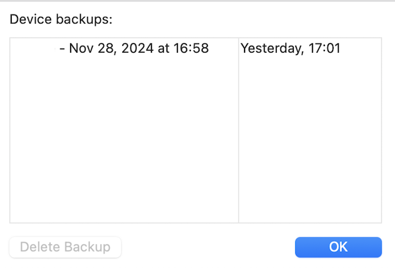
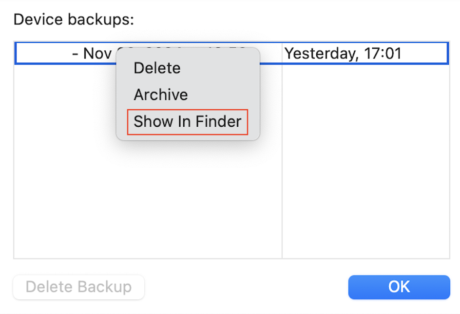
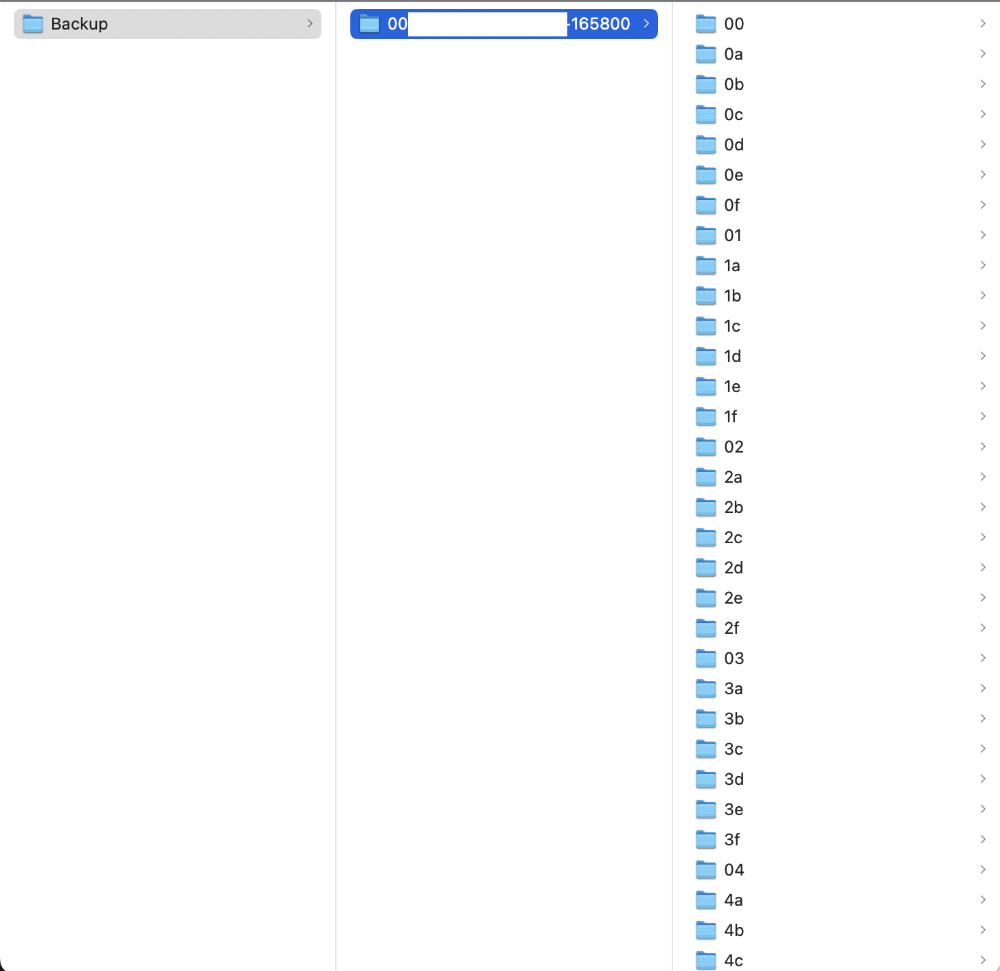
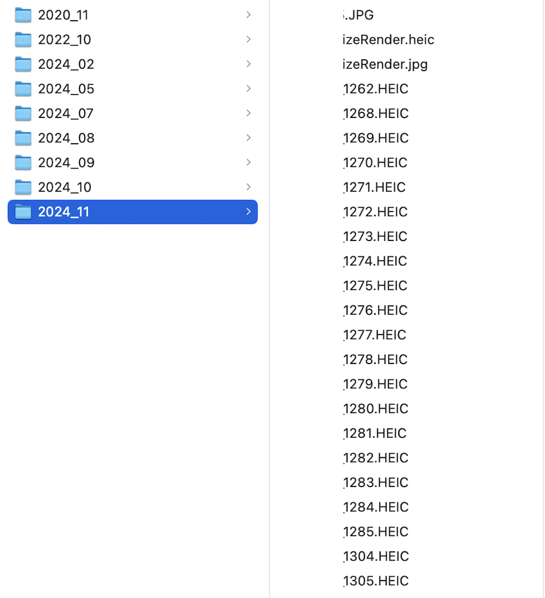
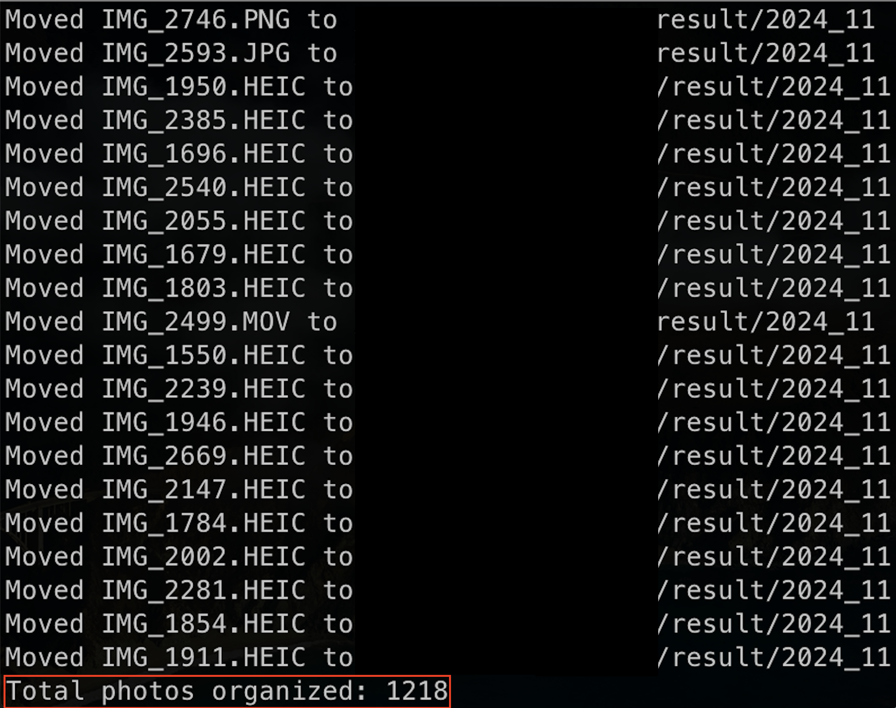
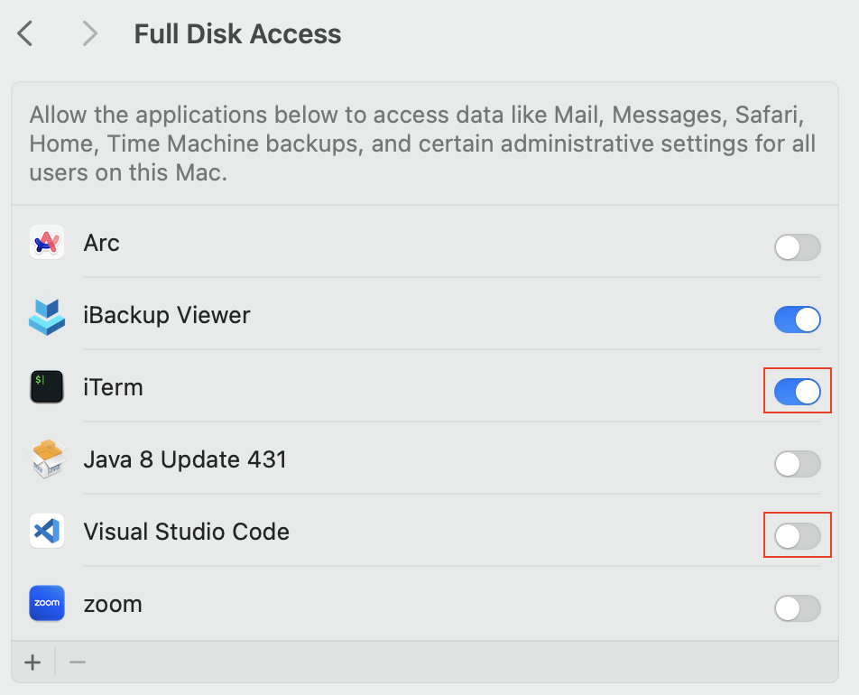

# BackUp Scripts

- After downgrading the IPhone iOS version, Backup files from higher iOS versions cannot be restored

    

    My iPhone 18.2v -> 18.1v (downgrade)
    
    It is the reason why, the button `Restore Backup`is disabled

- So, I made a Python Script to backup at least the important photos

### Prerequisite

- `Important!` : make sure that the backup files are already saved on your computer

    

    And Click it to check the backup file is existed

    

- Or check this path `... /Library/Application Support/MobileSync/Backup/00002110-....-165800`

    

    So, make sure that you already have a backup file

### Results

- `result` directory : Photos has been sorted and saved in the [Year]-[Month] format

    

- Display the total number of files saved 

    

# Settings

- To access all the directory, you need to allow the permission `Full Disk Access`

    

    If you want to run this code in VSCode, then click VSCode

- I used `iBackup Viewer` to verify that my Python script successfully extracted the photos. 
    
    you can download [iBackup Viewer](https://www.imactools.com/iphonebackupviewer/) and access those features for a fee

Next step, explain it how to use this code -> CLICK(https://)
