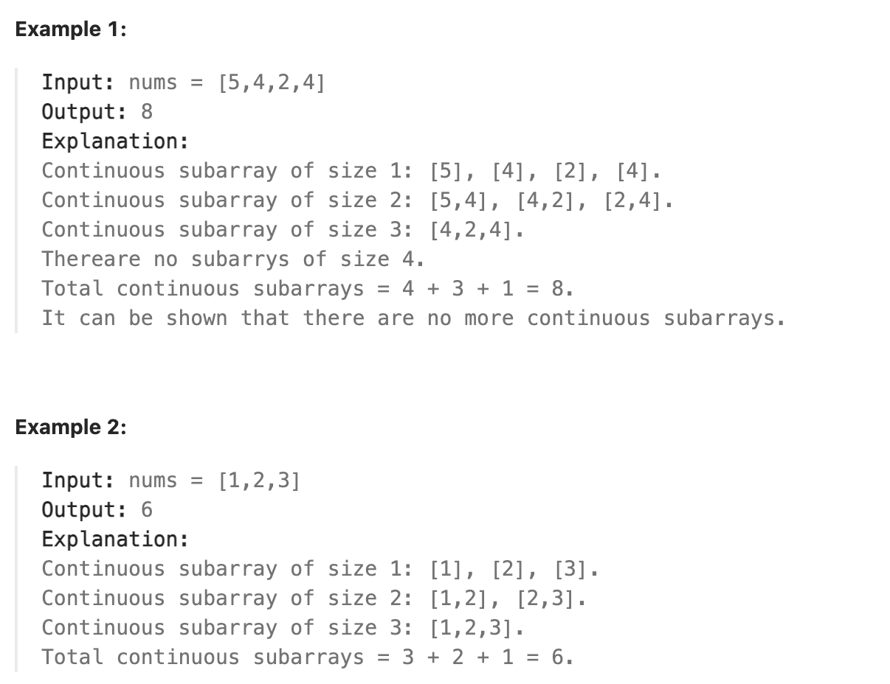

# Continuous Subarrays

- [Leetcode Website](https://leetcode.com/problems/continuous-subarrays/description/)

- Let i, i + 1, ..., j be the indices in the subarray

    Then, for each pair of indices i <= i1, i2 <= j, `0 <= |nums[i1] - nums[i2]| <= 2`

    

# Step by Step Optimization (C++)

1. Brute Force

    If `max - min > 2`, break → otherwise, count subarray

2. Optimization

    sliding window, monotonic deques

# 1. Brute Force

- simple and intuitive. but inefficient

### Code (C++)

```cpp
#include <iostream>
#include <vector>
#include <algorithm>
using namespace std;

int countSubarraysBruteForce(vector<int>& nums) {
    int n = nums.size();
    int total = 0;

    for (int i = 0; i < n; i++) {
        int mx = nums[i], mn = nums[i];
        for (int j = i; j < n; j++) {
            mx = max(mx, nums[j]);
            mn = min(mn, nums[j]);
            if (mx - mn > 2) break;
            total++;
        }
    }
    return total;
}

int main() {
    vector<int> nums = {5, 4, 2, 4};
    cout << countSubarraysBruteForce(nums) << endl;
}
```

### Time Complexity : O(n^2)

### Space Complexity : O(1)

- Only uses a few scalar variables (mx, mn, total, i, j). Therefore, no matter how large n is, the memory usage stays constant

# 2. Optimized

- maintain the max and min values efficicently with two deques (maxQ, minQ)

### Pseudocode

```text
int countSubarraysOptimized(vector<int>& nums)
    1. for right from 0 to n-1
        maxQ : not empty AND store "index of max"
        → nums[maxQ.front()] is always the maximum value
    
        minQ : not empty AND store "index of min" 
        → nums[minQ.front()] is always the minimum value
        
        # deque is only store indices, not value
        # nums[maxQ.back] → "maxQ.back == last index of maxQ"
    
    2. while nums[maxQ.front] - nums[minQ.front] > 2
        shrink window until valid: max - min <= 2

    3. count all vaild subarrays
        right = End index
        left = vaild start index of the window
        number of subarrays = right - left + 1

int main()
```

### Code (C++)

```cpp
#include <iostream>
#include <vector>
#include <deque>
using namespace std;

int countSubarraysOptimized(vector<int>& nums) {
    int n = nums.size();
    int total = 0;
    int left = 0;
    deque<int> maxQ, minQ;

    for (int right = 0; right < n; right++) {
        while (!maxQ.empty() && nums[maxQ.back()] <= nums[right]) {
            maxQ.pop_back();
        }
        maxQ.push_back(right);

        while (!minQ.empty() && nums[minQ.back()] >= nums[right]) {
            minQ.pop_back();
        }
        minQ.push_back(right);

        while (nums[maxQ.front()] - nums[minQ.front()] > 2) {
            if (maxQ.front() == left) maxQ.pop_front();
            if (minQ.front() == left) minQ.pop_front();
            left++;
        }
        total += (right - left + 1);
    }
    return total;
}

int main() {
    vector<int> nums1 = {5, 4, 2, 4};
    vector<int> nums2 = {1, 2, 3};

    cout << countSubarraysOptimized(nums1) << endl;
    cout << countSubarraysOptimized(nums2) << endl;
}
```

### deque

- To get the max and min values in each step in `O(1)` time, need to use deque

- maxQ : indices of elements in decreasing order [`front = max`, back = min]
    
    minQ : indices of elements in increasing order [`front = min`, back = max]


### Time Complexity : O(n)

- Each element is pushed and popped from each deque at most once

### Space Complexity : O(n)

- In the worst case, deque can store up to `n` indices