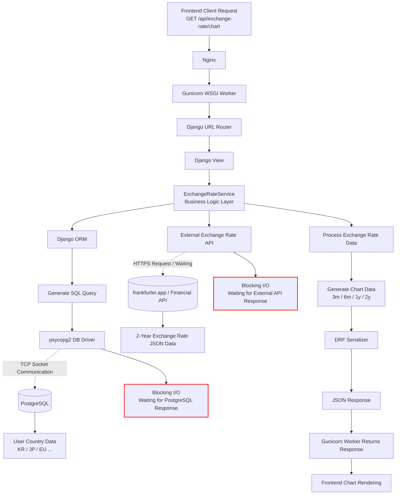

# Problem 

The first system was built as a `Django-based monolithic` architecture using Django + Gunicorn(WSGI)

And most CRUD features operated reliably within this structure

- The request-response flow is straightforward, making debugging and transaction management relatively simple.Each incoming request was handled and returned by a `Gunicorn worker` in a synchronous processing model

- In the first stage, development productivity is the hight priority. Django ORM and the Django Admin ecosystem enabled rapid feature development

However as the service grew, bolltenecks began to appear due to incresing:

- external API calls
- Google Login
- Authentication / Authorization workflows
- RDB(PostgreSQL) access and other I/O-heavy operations

This limitations were primarily caused by WSGI's synchronous request-processing model

# Architecture - Exchange Rate

Hackonomics Service that I made
- Users select their country in their profile, and the selected country is stored in DB
- After login, display exchange rate trends against USD based on the user's selected country, visualized through graph over multiple time ranges(3 months, 6 months, 1 year, 2 years)



### Distinction

- Django ORM : an abstraction layer that allows developers to interact with the database using Python objects instead of writing raw SQL query
- Codebase : the overall code structure
- Workload : the characteristics of the tasks a system is required to process

  Example: 

  | Workload Type     | Characteristics                                  |
  | ----------------- | ------------------------------------------------ |
  | CPU-bound         | computation-intensive                            |
  | I/O-bound         | heavy waiting on I/O operations                  |
  | latency-sensitive | response time is critical                        |
  | throughput-heavy  | high concurrent processing capacity is important |

### Flow

1. API request arrives from Frontend (GET /api/exchange-rate/)

    This request is forwarded through
    ```
    Nginx → Gunicorn → Django WSGI application
    ```
    Gunicorn runs multiple WSGI worker processes and each incoming request is assigned to a specific worker (One request = One worker occupied)

    Request reaches the Django WSGI application, the Authentication Middleware is executed first
  
      - Validates JWT-based or session-based authentication
      - Injects the current authenticated user (request.user) into the request context

2. Then, URL router resolves the endpoint and invoke the corresponding Django view

    View is only for `HTTP-layer`: request parsing, authentication validation, serializer validation, response formatting

    After verifying the authenticated user → Request to the Service Layer where the core business logic is executed

3. Serivce Layer

    The service layer invokes Django ORM to retrieve the user information
        
    ```
    User.objects.get(id=request.user.id) -> ORM Query
    ```

    This is not simply a python function call, It is `network-bound database operation`
    
    Django ORM converts the Python-based query into SQL. Then SQL is passed to psycopg2 (PostgreSQL DB Driver), which performs TCP socket-based network communication with PostgreSQL

      - Send SQL → wait for DB response → receive result
  
    During this entire process, Gunicorn worker remains occupied in a blocking state until the database response is fully received

4. Service Layer - External Exchange Rate API Call

    Calls (frankfurter.app) to retrieve exchange rate data in JSON format. Once the external API response is received, the data is processed into (3nonth, 6month, 1year and 2 years) and transformed into a format compatible with Frontend chart library

5. Serializers

    The python objects returned from Service Layer are serialized into JSON format using DRF seralizers
  
      - Stable contract between Frontend and Backend
  
    Eventually, Django view returns JSON response in the following format:
    ```
    {
      "3m": [...],
      "6m": [...],
      "1y": [...],
      "2y": [...]
    }
    ```
    Then Gunicorn Worker sends the final response back to Frontend
  
### Production Issues

Bottlenecks started to appear during real production operation
Main bottlenecks included:

- waiting for external financial API responses (frankfurter)
- PostgreSQL query waiting
- network I/O waiting

In practice, workers spent far more time in waiting states than performing actual CPU computations
This exposed the limitations of the WSGI-based synchronous worker architecture

- When many users simultaneously requested 

    exchange-rate charts, delayed external API responses occupied the worker pool
    → eventually impacted overall API response times

- It became clear that areas involving external API communication and high-concurrency I/O workloads required an asynchronous architecture

# Architecture - Login

### Flow

1. Frontend initially Google Login and sends a request to Backend

    The request flow is:
    - Nginx → Gunicorn Worker → Django WSGI Application

2. Django URL Router resolves the `/auth/google/login` endpoint and invokes the corresponding Django View

    View was intentionally designed to remain `thin` and only handle `HTTP-layer`, while the actual business logic was delegated to the Service Layer.

3. OAuth Processing Inside the Service Layer

    Inside Service layer, communicates with the Google OAuth server to exchange the `Authorization Code for an Access Token` and retrieve user information

    The service layer then:
      - checks existing users through the Django ORM
      - creates new users if necessary
      - stores refresh tokens
      - updates the last login timestamp
      
4. Django ORM Query

    After receiving Google user information, Service layer queries the database through the Django ORM
    ```
    User.objects.get(email=google_email)
    ```
    
    This is a `Network-bound database operation` involving communication with the PostgreSQL server. The ORM query is converted into an SQL query, and the generated SQL is transmitted to PostgreSQL through psycopg2 (PostgreSQL driver).

5. New User Creation (INSERT Query)

    If the user does not exist, a new user record is inserted into the database.

6. JWT / Refresh Token Processing

    Generates JWT and refresh tokens for authentication and session management.

7. Serialization + Response

    Finally, Django View returns a JSON response, and the Gunicorn worker sends the response back to Frontend

### Problems in Production

The Google OAuth login flow was fundamentally based on synchronous blocking I/O
As the production traffic increased, bottlenecks gradually began to appear during the Google OAuth login process.

The core bottlenecks were:

    - Google OAuth API response waiting
    - PostgreSQL query waiting
    - Redis access waiting
    - network I/O latency

In reality, workers spent significantly more time waiting for `external API responses` and `database responses` more than performing actual CPU computations
So, real bottleneck was much closer to:
- synchronous worker occupancy
- Worker Pool Exhaustion

During operation, if Gunicorn was running with 4 workers and 4 users simultaneously waited for Google OAuth responses, new login requests could no longer be processed immediately

The core issue was not merely request latency itself, but rather the fact that workers remained occupied during waiting states, eventually exhausting the entire worker pool

As a result:
- throughput reduction
- concurrency reduction
- increased login latency

all began occurring simultaneously

### Attempt 1 - Gunicorn Worker Scaling

An initial attempt involved increasing the number of Gunicorn workers (4 → 8 workers) as `horizontal scaling`

However, increasing worker counts introduced additional problems:

- increased memory usage
- increased context switching overhead
- increased container/infrastructure costs

In addition, Django ORM and psycopg2 fundamentally operate synchronously

Simply introducing async views was not sufficient to solve the problem. Even when using async def, much of the existing codebase still depended on synchronous components such as:

- Django ORM
- psycopg2
- middleware
- third-party libraries

### Final Decision 

Eventually, the monolithic Django service was restructured into:

- Django handling core business logic
- high-concurrency I/O domains such as authentication, authorization, and OAuth processing being separated into a `Go-based service`

Go’s goroutine-based concurrency model allowed the system to process large numbers of external OAuth requests simultaneously at a much lower cost, significantly reducing the worker occupancy problem