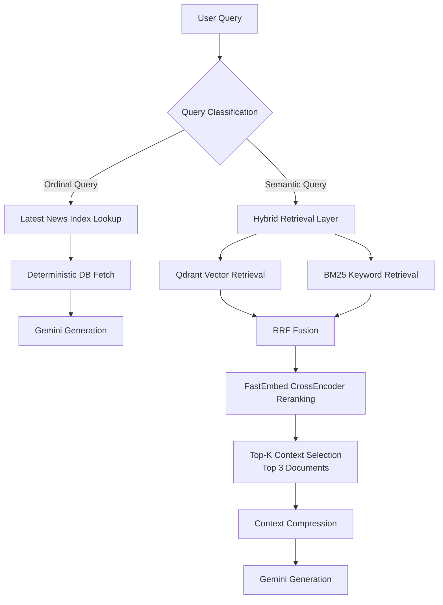

# Problem 

The chatbot initially relied on direct Gemini API prompting against financial-news records stored in PostgreSQL(RDB)

Every 6 hours:
- Gemini API summarized top 5 financial news
- Stored in PostgreSQL

However, the system produced unreliable answers for retrieval-style queries

### Example

Example query : "Explain the first news easily"

The model frequently hallucinated because:
- the ordianl reference ("first") was ambiguius to the LLM

# Architecture



### Distinction

Query : the user's question
Retrieval : the process of finding relevant documents
Context : the retrieved result used as reference for generation
Fusion : the process of combining multiple retrieval results into a single final ranking

### Step1
News data is not stored as simple text string. It is converted into `embedding vector` using Python library `FastEmbed`
```
"Federal Reserve tightening concerns ..." → [0.183, -0.442, 0.918, ...] This array is called Embedding vector
```
The vectors are stored in Qdrant(Vector DB). Queries are also converted into vectors and Qdrant calculates how semantically similar the two vectors are 
- Queries Vector and News Vector

Using `distance=Distance.COSINE`, it measures the similarity of vector directions:
- Similar vector directions = similar semantic meaning

### Step2
BM25 is fundamentally based on `lexical matching` rather than semantic understanding. Financial News retrieval has limitations when relying solely on simple keyword search.
For example:
```
Query: "Interest rate hike concerns"
But the actual news article contains the phrase "Federal Reserve tightening concerns", there may be no direction keyword overlap at all

Query Token : interest, rate, hike, concerns
News Token : Federal, Reserve, tightening, concerns
```
The only overlapping word between the two expression is `concerns`
So, the RAG fails to understnad the semantic relationship between the two expression

### Step3
However Vector retrieval alone also has limitations. In financial news retrieval, exact entity matching is often critical for terms such as company name, stock tickers or country names

For example:
```
Keywords : "TSLA", "S&P500"
It may require precise lexical matching rather than semantic similarity
```
And vector retrieval frequently returns `loosely related documents` within the top-k results

Loosely related documents example: 
```
Query : "TSLA stock crash"

→ Retrieval results
- Tesla news
- EV market news
- Nasdaq decline news
- tech stock concerns
```
Some of these results are only loosely related - semantically similar, but not necessarily the exact news the user is actually looking for

### Step4
To this issue, a `hybrid retrieval` architecture was introduced

The retrieval pipeline was redesigned to preform both:
- semantic vector search
- BM25-based keyword search
simultaneously.
Vector search is handled by Qdrant, while BM25 is responsible for keyword relevance matching
The two retrieval results are then combined using `RRF`(REciprocal Rank Fusion)

### Step4 - Attempt 1
`weighted average` approach was attempted

For example, both the semantic similarity score and the BM25 score was normalized. But the underlying score distributions of vector similarity and BM25 were different
- Cosine similarity score : distributed within a range of 0 ~ 1
- BM25 scores very irregulary depends on: document length, term frequency, keyword distribution etc

As a result, score normalization itself became difficult, casuing retrieval rankings to become biased towrd one side

### Step4 - Attempt 2
weighted average approach also introduced high tuning complexity

Why? The query distribution in financial news retrieval continuously changes
- some queries require strong semantic relevance
- while others depend heavily on exact keyword precision

For example:
1. Semantic relevance is important
```
Query : "EV car market"
News : "Tesla and BYD continue global EV expansion"

In this case, EV car ≈ "Tesla" or "BYD"
```
Semantic relationship is required to retrieve the relevant documents

2. Exact Keyword Precision is important
```
Query : "Tesla earnings"
User is specifically looking for news related to Tesla

But, if only semantic retrieval is used, It may also retrieve loosely related documents such as

- EV market, eletric vehicle compancy news
```
These documents are semantically related, but they may not actually contain the exact information the user intended to find

In this case, BM25-based lexical matching becomes much more important

### Step5
To solve this issue, RRF (Reciprocal Rank Fusion) was introduced
RRF is not a score-based fusion method. `Rank-based` fusion approach

Instead of relying on the absolute retrieval score of documents, RRF uses the ranking position of each document within each retrieval system
- The ranking position from Qdrant vector retrieval
- The ranking position from BM25 retrieval
Each ranking are calculated separately, and the reciprocal rank score are summed together

The biggest reason for choosing RRF was stability. Rank-based fusion is not directly affected by the underlying retrieval score distributions

Even if:
- the cosine similarity distribution changes
- or BM25 scoring pattern varies
the retrieval quality remains stable as long as the relative ranking order is preserved

# The End
In the naive pipeline, retrieval noise and excessive context sometimes caused response times to exceed 80 seconds. After optimizing the retrieval pipeline, the average response time was reduced to under 3 seconds

